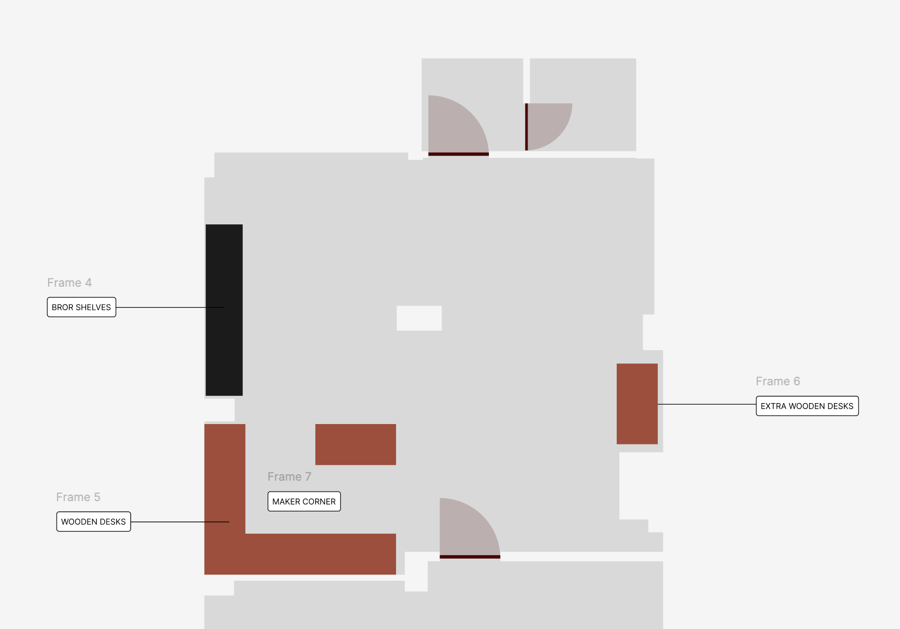
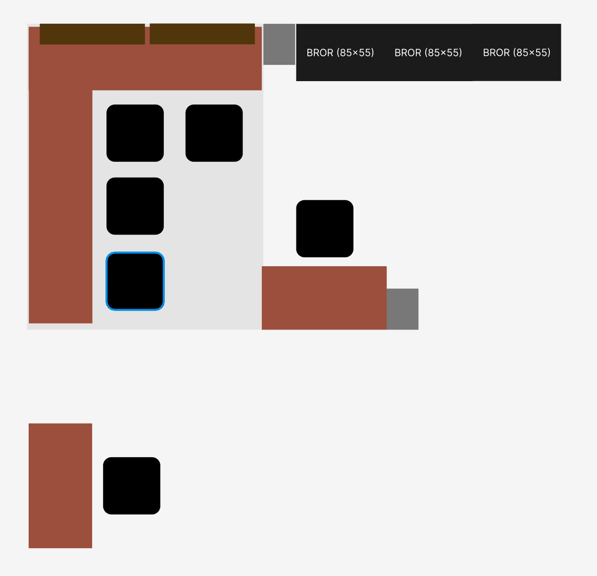
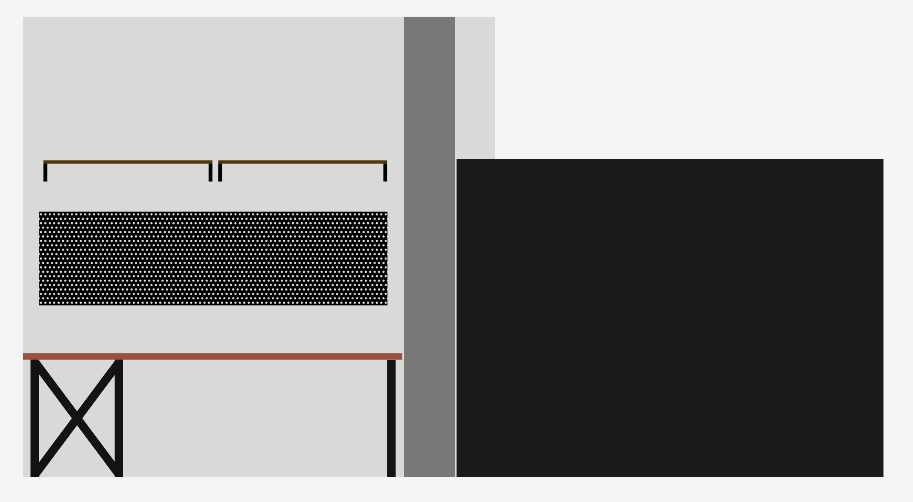
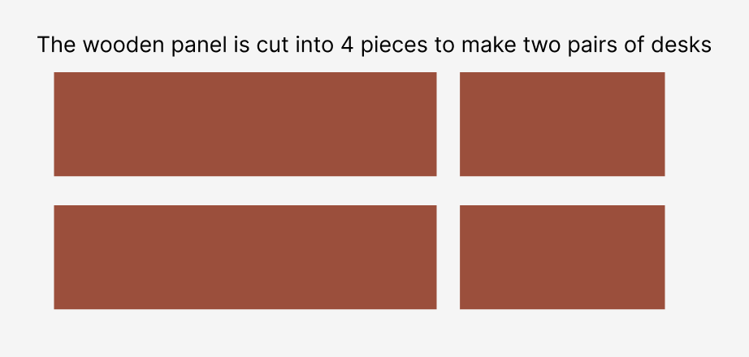

👉 | HEP 4: Introduce Maker Corner
--- | ---
Authors | [@safaorhan](https://github.com/safaorhan)
Status | Active
Related PRs | [#7](https://github.com/konyahackerspace/heps/pull/7)
Related HEPs | -

## Introduction

This HEP sets foundations to build a multi-use workshop area to one corner in the inner room of the hackerspace that can be used for tinkering & hacking stuff.

**General layout of inner room of Hackerspace:**

**Close-up View of Maker Corner**

**Side-view of the desk, pegboard and wall shelves:**

I have shot a video to help you visualize the drawings showcasing a very similar setup from my office workshop, check it out:
https://www.youtube.com/watch?v=uPKfGH0mSGE

## Room Plan
You can see dimensions and margins in Figma: https://www.figma.com/design/USB0Fd65ew0q2gsCZJzYKZ/Maker-Corner-Room-Plan?node-id=0-1&t=Gr1VNRiJU5nuxjgf-1

1 px on Figma = 1mm in real life

## Pledging
This HEP accepts pledges. If you want to see maker corner come to life you can pledge some money in the PR comments. Then I will update this table. When the total pledge reaches the required amount, all donors will be asked to donate the money to the bank account, the HEP can be merged and we can start building it.

| Donor | Amount |
| ---- | ---- |
| @safaorhan | 8000₺ |
| @zguneri | 20000₺ |
| @hibestil  | 3000₺ |
| @theilgaz  | 1.2kg PLA |
| Hackerspace Reserves | `remaining` |
| `Collected Total` | 31000₺ + 1.2kg PLA |
| `Required Total` | 81174₺  + 1.2kg PLA |

## Why IKEA?
I picked furniture from IKEA because, IKEA furniture is arguably the most hacker-friendly furniture.
- The models are known world-wide and there's a good community of hackers building stuff compatible with IKEA furniture. Check out [MakerWorld](https://makerworld.com/en/search/models?keyword=ikea) to see it with your own eyes. I, myself, printed many gadgets and upgrades for my IKEA furniture at my office.
- The furniture is modular enough that people are combining them together in unexpected ways. See [/ikeahacks](https://reddit.com/r/ikeahacks) subreddit.
- The furniture is replacable. I admit that they are not top-quality, but because of their price and maket availability for years, we can hope that we can replace anything later on if they are damaged.
- The furniture is upgradable, the designers tend to keep same sizes for their table-tops, desk-legs etc.
so that if we want to replace a bench with a fancier wooden table top, it will be possible without changing the plan.
- The furniture is extendable, you can always buy more accessories for the pegboard, buy more shelves for the shelving unit, add another BROR component to the storage area, etc.

After all the praise, I also have to mention some drawbacks of using IKEA furniture:
- There are serious problems with items getting out of stock regularly. This has been the case globally for years. This makes us do multiple orders in different times to get all we want.
- It's not top quality.
- We have to assemble everything ourselves.
- If we get some help from a local carpenter, we can get furniture with exact measurements, which is not an option with fabricated furniture.

Lastly, I chose IKEA furniture because, I am basically copying hours and hours of design decisions from my own workshop room in my office. I've spent weeks designing, experimenting and upgrading it to it's final form and can tell you it's hard to create a functional and good-looking space.

## Work Area
Work area will be used to hack and tinker on stuff, mostly while sitting. The workbenches are set 70cm high because of this. The workbenches are enough to accommodate 3 people working on projects at the same time, providing enough horizontal surface area for their projects while having enough space for tools.

The shorter workbench has access to the pegboards and is strongly task-lighted and hence may be used for:
- working with a rotary tool,
- cleaning and assembling 3d prints,
- tinkering stuff with pliers or a screwdriver,
- cutting things with a utility knife on a cutting mat,
- measuring stuff with a compass, or
- working with pens & markers for craft projects, etc.

all while having good-looking top-down shots if one wants to make videos.

The longer workbench may be used for
- soldering and debugging electronics
- programming micro-controllers
- working with a laptop or
- any project that requires wider space

~The shorter workbench needs to be cut to size to be able to fit between the drywall and the concrete column. No other furniture needs modification.~

We ended up letting go of initially planned SALJAN benches and instead manufactured a set of custom massive desks, see below:

### Custom Manifactured Massive Wooden Desks
We initially wanted to get two SALJAN benches from IKEA. @zguneri offered his help getting some massive wooden desks manufactured around the same cost. The cost ended up being higher than we initially expected. @zguneri owned this estimation error and covered the excess cost from his pocket. (Shout out to Zahit abi, once again: thanks a lot for providing us with sturdier and more handsome wooden furniture)

The plan is to get one massive wooden panel from Hasan Kulu, then getting the panel cut into for pieces as shown below to get two identical wooden desks along with two smaller extra.

We'll then get some iron profile legs and support manufactured in size to have a very sturdy desk setup.

The process / recipe for four custom made desks:

- Bought massive wooden panel (BC quality 344 cm x 122 cm x 4cm) from Hasan Kulu (8000 TRY)
- Cut it into four ( 224 x 60, 224 x 60, 120 x 60, 120 x 60)
- Sand all surfaces
- Soften the edges
- 2 times filler varnish, waiting 2 days in between
- Last layer silk matte varnish
- Made iron profile legs and support edges (2mm profile)
- Hand paint ironware
- Install ironware to desks
- Get it shipped to hackerspace

All of them totaled 30.500 TRY, here's a breakdown:

| Item | Cost 
| ---- | -----
| Massive pinewood panel | 7500 TRY
| Iron legs | 11000 TRY
| Carpentry and shipping | 12000 TRY
| `TOTAL` | 30500 TRY

## Storage Area
The storage area consists of three BROR shelving units and can be used for:
- storing projects of the members in labeled storage boxes
- organizing maker supplies in labeled storage boxes
- accommodating 3d-printers
- keeping everyday tools handy (the shelving unit material is metal and neodymium magnets can hold surprisingly heavy tools)
- displaying cool projects
- holding bulky equipment like drills, chargers, etc.

The storage area is placed perpendicular to the wall to:
- isolate the corner visually from the rest of the room
- enable access from both sides of the shelves (this might come handy when we place 3d-printers to shelves)

There's also more storage area on the shelves above the short workbench, which also provides a surface for tasks lights to be placed.

## Bill of Materials
|  \#  | Name | Total | Link | In stock?
| ---- | ---- | ----- | ---- | ----
| 4 | Custom made massive pinewood desks | 30500₺ | Custom Made | -
| 3 | BROR shelving units 85x55 | 22497₺ | [Ikea](https://www.ikea.com.tr/urun/bror-siyah-85x55x190-cm-raf-unitesi-69471738) | Yes
| 1 | FJÄLLBO wall shelves combo | 3798₺ | [Ikea](https://www.ikea.com.tr/urun/fjallbo-siyah-101x20-cm-duvar-rafi-kombinasyonu-69338546) | No[^3]
| 2 | SKÅDIS 76x56 black | 2198₺ | [Ikea](https://www.ikea.com.tr/urun/skadis-siyah-76x56-cm-cok-amacli-pano-50534378) | Yes
| 1 | SKÅDIS 56x56 black | 899₺ | [Ikea](https://www.ikea.com.tr/urun/skadis-siyah-56x56-cm-cok-amacli-pano-10534375) | Yes
| 2 | SKÅDIS accessory pack | 880₺ | [Ikea](https://www.ikea.com.tr/urun/skadis-beyaz-cok-amacli-pano-parcasi-20586420) | Yes
| 50 | UPPSNOFSAD storage box with lid | 5500₺ | [Ikea](https://www.ikea.com.tr/urun/uppsnofsad-siyah-35x25x14-cm-9-lt-kapakli-kutu-99393107) | ~Yes[^4]
| 4 | ASR-4035 20L heavy duty storage box |  1598₺ | [Nalburdayım](https://www.nalburdayim.com/super-bag-kilitli-saklama-kutusu-20-lt-asr-4035/) | Yes
| 4 | ASR-4037 40L heavy duty storage box |  2318₺ | [Nalburdayım](https://www.nalburdayim.com/super-bag-kilitli-saklama-kutusu-42lt-asr-4037/) | Yes
| 6 | Trunklinea 9W 3000K light bar |  1954₺ | [ElpimShop](https://www.elpimshop.com/philips-trunklinea-9w-3000k-884cm-sari-gun-isigi-bant-armatur-915005196001) | Yes
| 5 | Trunklinea connection cable |  378₺ | [Alkanlar](https://www.alkanlaronline.com/urun/philips-trunkable-armatur-baglanti-aparati-31090-31-66-915004986701) | Yes
| 1 | Power cable with switch | 151₺ | [Amazon](https://www.amazon.com.tr/%C5%9Eahnet-Arapuarl%C4%B1-Fi%C5%9Fli-Kablosu-Beyaz/dp/B0BHPFRKRX) | Yes
| 4 | Viko Multilet 6-Socket, Switched, No-Cable, black | 1460₺ | [Trendyol](https://www.trendyol.com/viko/multi-let-6-li-siyah-anahtarli-kablosuz-cocuk-korumali-grup-priz-p-32894864) | Yes
| 1 | Öznur 3x1.50 TTR Power Cable, Black, 50m | 2750₺ | [Amazon](https://www.amazon.com.tr/%C3%96ZNUR-Marka-100-Bak%C4%B1r-Elektrik-Kablosu/dp/B0DR9JBY71/) | -
| 24 | 3D-printed corner supports for BROR | 1.2kg PLA | [MakerWorld](https://makerworld.com/en/models/559852-ikea-bror-shelf-corner-bracket) | -
| 12% | IKEA Delivery | 4293₺ | - | - 
| - | `Total` | `81174₺` | - | -

## Cancelled BoM
|  \#  | Name | Total | Link | In stock?
| ---- | ---- | ----- | ---- | ----
| 1 | ~SÄLJAN bench top. 186cm~ | ~4699₺~ | [Ikea](https://www.ikea.com.tr/urun/saljan-mese-gorunumlu-laminat-186x3-8-cm-tezgah-60439173) | Yes
| 1 | ~SÄLJAN bench top. 246cm~ | ~5899₺~ | [Ikea](https://www.ikea.com.tr/urun/saljan-mese-gorunumlu-laminat-246x3-8-cm-tezgah-80439209) | No[^1]
| 10 | ~ADILS black legs~ | ~3000₺~ | [Ikea](https://www.ikea.com.tr/urun/adils-siyah-70-cm-calisma-masasi-ayagi-70217973) | No[^2]
| 20 | ~GLIS transparent box 3 pack~ | ~2980₺~ | [Ikea](https://www.ikea.com.tr/urun/glis-seffaf-17x10-cm-kapakli-kutu-40466148) | No[^5]

## After Photos

[^1]: If this won't never be available online, we either need to switch to an available benchtop variant (different color or material) or we may physically go to Ankara or Antalya to get it from a physical IKEA store.
[^2]: We can fall back to color grey, or to OLOV legs (which are matte black and metalic), or consider other legs.
[^3]: We have some wall shelf alternatives that could work. But if dimensions change, we may have to pick different light bars. So do not order light bars and other light related equipment without ensuring this.
[^4]: Yesterday, there was stock for 50 units. Today it's 46. But we are not strict with the number 50 here, we can get as much as we can.
[^5]: There are colored boxes in stock. If you don't hate the colors, we can go with the childish colored ones. Haha. Update: It came back to stock but rest of the HEP was done already, I took it out of scope of this HEP.
